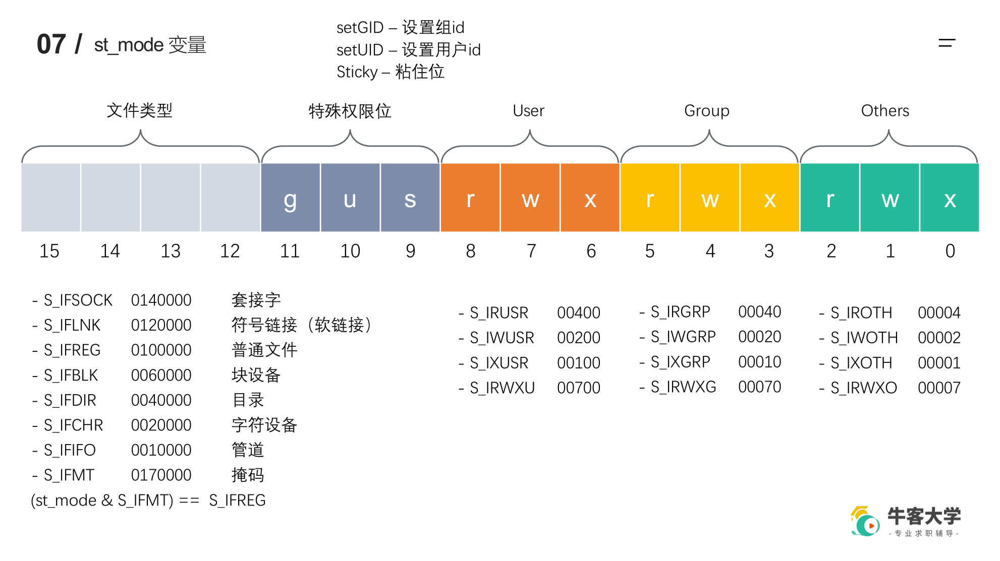

### Linux开发环境搭建

1. 安装虚拟机
2. 安装 `vscode + remote ssh` 插件
3. `ssh` 远程连接虚拟机

### GCC

```shell
gcc -E a.c -o a.i # 预处理
gcc -S a.i -o a.s # 编译
gcc -c a.s -o a.o # 汇编
gcc	a.o b.o -o a.out # 链接
gcc a.c -l pthread -o a # 手动添加链接库
-o # 指定生成文件名称
-L # 指定包含库的的搜索目录
-I # 指定 include 包含文件的搜索目录
-g # 生成调试信息，用于 GDB
-D # 指定一个宏
-w # 不生成警告
-Wall # 生成所有警告
-On # 优化等级 0-3（0没有，1默认）
-std # 指定 C 方言，如 -std = C99
```

我们看下 `-D` ，这个的作用就是指定一个宏：

```c
#include<stdio.h>

int main()
{
#ifdef DEBUG
    printf("log out.\n");
#endif
    printf("Hello.\n");
    return 0;
}
```

如果我们加入了 `-D DEBUG` 那么就会输出 `log` ，否则，不会输出。

可以认为 `g++ = gcc -lstdc++` 链接了 `C++` 库。

###  静态库的制作与使用

命名：

- `Linux`：`libxxx.a`
- `Windows`：`lixxxx.lib`

优点：

- 安全，可以不用提供源程序，保护俺的知识产权

```shell
# 源文件真的很简单，所以就不放了
➜  nowcoker tree # 一个项目的一般结构          
.
├── include
│   └── head.h
├── lib
├── main.c
└── src
    ├── add.c
    ├── div.c
    ├── mult.c
    └── sub.c

3 directories, 6 files
➜  nowcoker cd src 
➜  src gcc -c add.c div.c sub.c mult.c -I ../include 
➜  src ar rcs libcalc.a add.o div.o mult.o sub.o # ar 就是生成静态库的命令
➜  src mv libcalc.a ../lib 
➜  src cd ..
➜  nowcoker gcc main.c -o calculate -I ./include -L ./lib -l calc
➜  nowcoker ./calculate 
2 + 2 = 4
2 - 2 = 0
2 * 2 = 4
2 / 2 = 1
# 只需要提供 include 和 lib ，src 自己保存就好
```

### 动态库的制作与使用

命名规则：

- `Linux`：`libxxx.so`
- `Windows`：`libxxx.dll`

```bash
➜  nowcoker tree
.
├── include
│   └── head.h
├── lib
├── main.c
└── src
    ├── add.c
    ├── div.c
    ├── mult.c
    └── sub.c

3 directories, 6 files
➜  nowcokercd src                   
➜  src gcc -c -fPIC *.c -I ../include # 得到和位置无关的 .o 文件
➜  src gcc -shared *.o -o libcalc.so # 制作动态库
➜  src mv libcalc.so ../lib 
➜  src cd ..
➜  nowcoker gcc main.c -o calculate -I ./include -L lib -l calc # 只加载了动态库信息
➜  nowcoker ldd calculate # 检查动态库依赖关系
        linux-vdso.so.1 (0x00007fff45de1000)
        libcalc.so => not found # 找不到
        libc.so.6 => /lib/x86_64-linux-gnu/libc.so.6 (0x00007fa62d052000)
        /lib64/ld-linux-x86-64.so.2 (0x00007fa62d288000)
➜  nowcoker ./calculate 
./calculate: error while loading shared libraries: libcalc.so: cannot open shared object file: No such file or directory
```

对于 `elf` 格式的可执行程序，是由 `ld-linux.so` （动态载入器）来完成的，它先后搜索 `elf` 文件的 `DT_RPATH` 段 ——> 环境变量 `LD_LIBRARY_PATH` ——> `/etc/ld.so.cache` 文件列表 ——> `/lib/，/usr/lib` 目录找到库文件后将其载入内存。

```shell
# 终端临时添加
➜  nowcoker pwd
/home/ceyewan/CodeField/CODE_CPP/nowcoker
➜  nowcoker export LD_LIBRARY_PATH=$LD_LIBRARY_PATH:/home/ceyewan/CodeField/CODE_CPP/nowcoker/lib
➜  nowcoker ldd calculate
        linux-vdso.so.1 (0x00007ffc00dff000)
        libcalc.so => /home/ceyewan/CodeField/CODE_CPP/nowcoker/lib/libcalc.so (0x00007fb9f2606000)
        libc.so.6 => /lib/x86_64-linux-gnu/libc.so.6 (0x00007fb9f23d7000)
        /lib64/ld-linux-x86-64.so.2 (0x00007fb9f2612000)
➜  nowcoker ./calculate 
2 + 2 = 4
2 - 2 = 0
2 * 2 = 4
2 / 2 = 1
# 用户级别
# 将 export 命令加入到 ~/.bashrc 并 source 使之生效
# 系统级别
# 将 export 命令到 /etc/profile 并 source 使之生效

# 也可在 /etc/ld.so.conf 中直接添加路径
```

- 静态库：
  - `GCC` 进行链接时，会把静态库中代码打包到可执行程序中
  - 优点，使用简单
  - 缺点，造成可执行文件体积庞大，重复加载等
- 动态库：
  - `GCC` 进行链接时，动态库的代码不会被打包到可执行程序中
  - 缺点：使用复杂
  - 优点：无需加载，速度快，共享使用（加载到内存后可以供多个进程使用）

### Makefile

- `Makefile`：自动化编译，编译顺序、重新编译等复杂功能。

```
xxx[目标]: xxx[依赖]
	xxx[shell 命令]
```

变量：

- 自定义变量 变量名=变量值 `var=hello`
- `AR`：归档维护程序的名称，默认为 `ar`
- `CC`：`C` 编译器的名称，默认值为 `cc`
- `CXX`：`C++` 编译器的名称，默认值为 `g++`
- `$@`：目标的完整名称
- `$<`：第一个依赖的文件的名称
- `$^`：所有的依赖文件
- 获取变量的值，`$(变量名)`

```makefile
src=sub.c add.c mult.c div.c
target=calculate
$(target): $(src)
	$(CC) $^ -o $@
```

模式匹配：

- `%`：通配符，匹配一个字符串，`%.o: %.c` ，两个 `%` 匹配的是同一个字符串。

```makefile
%.o:%.c
	gcc -c $< -o $@
```

函数：

- `$(wildcard PATTERN...)`
  - 获取指定目录下指定类型的文件列表
  - `$(wildcard *.c ./src/*.c)` 得到当前目录和 `src` 目录下的 `.c` 文件
- `$(patsubst <pattern>,<replacement>,<text>)`
  - 查找 `<text>` 中的单词是否符合模式 `<pattern>` ，如果匹配的话，则以 `<replacement>` 替换
  - `$(patsubst %.c, %.o, a.c b.c)` 返回 `a.o` 和 `b.o`

`clean` 功能：

```makefile
.PHONY:clean
clean:
	rm *.o -f
```

编译一下我们的计算器，

```makefile
src=$(wildcard *.c ./src/*.c)
objs=$(patsubst %.c, %.o, $(src))
target=calculate

$(target):$(objs)
	$(CC) $^ -o $(target) -I ./include

%.o: %.c
	$(CC) -c $< -o $@ -I ./include

.PHONY:clean
clean:
	rm -f $(objs)
```

执行结果：

```shell
➜  nowcoker make      
cc -c main.c -o main.o -I ./include
cc -c src/add.c -o src/add.o -I ./include
cc -c src/div.c -o src/div.o -I ./include
cc -c src/mult.c -o src/mult.o -I ./include
cc -c src/sub.c -o src/sub.o -I ./include
cc main.o src/add.o src/div.o src/mult.o src/sub.o -o calculate -I ./include
➜  nowcoker make clean
rm  main.o  ./src/add.o  ./src/div.o  ./src/mult.o  ./src/sub.o
```

参考资料：

> https://seisman.github.io/how-to-write-makefile/index.html

### GDB

准备工作：

- 关闭 `-O`优化，开启 `-Wall` 显示更多的 `warning` 
- 开启 `-g` 选项，在可执行文件中加入源代码的信息，比如可执行文件中第几条机器指令对应源代码的第几行，但并不是把整个源文件嵌入到可执行文件中，所以在调试时必须保证 `gdb` 能找到源文件。

GDB命令：

- 启动 `gdb 可执行程序`
- 退出 `quit/q`
- 给程序设置参数，`set args 10 20` ，显示参数，`show args`
- 使用帮助 `help [xxx]`
- 查看当前文件代码 `list/l [xx](行号/函数名/文件名:行号/文件名:函数名)`
- 设置显示的行数，`show[set] list/listsize`
- 设置断点，`break/b [xx](行号/函数名/文件名:行号/文件名:函数名)`
- 查看断点，`info/i b/break`
- 删除断点，`d/del/delete 断点编号`
- 设置断点无效/生效，`dis/disable[ena/enable] 断点编号`
- 设置条件断点，一般用于循环，`b 10 if i==5`
- 运行 `gdb` 程序，`start(程序停在第一行)`，`run(遇到断点才停)`
- 继续运行，下个断点停，`continue/c`
- 向下执行一行代码，不进入函数体，`next/n`
- 向下单步调试，进入函数体，`step/s`，跳出函数体，`finish`
- 变量输出，`print/p 变量名`，`ptype 变量名`
- 自动变量操作，自动打印指定变量的值，`display 变量名`
- 修改变量的值，`set var 变量名=变量值`；跳出循环，`until`

### 标准 C 库和 Linux 系统 IO 函数的对比

就以 `fopen` 和 `open` 函数为例，我们来看看区别：

```c
FILE *fopen(char *filename, char *mode);
int open(const char *path, int access,int mode);
/* open 是系统提供的，fopen 是标准 C 库函数
 fopen 是封装了 open 的具有缓冲区的更高一级的函数，可以跨平台使用*/
```

### 虚拟地址空间

 分为内核区和用户区，虚拟内存由操作系统管理。

### 文件描述符

内核区的进程控制块（PCB），维护文件描述符表，我们可以通过内核区的 `PCB` 中的文件描述符表查找文件描述符来定位文件的位置。

> 前 3 个文件描述符，默认已经打开
>
> `0 -> STDIN`
>
> `1 -> STDOUT`
>
> `2 -> STDERR`

### open 函数

```c
# man open
#include <sys/types.h>
#include <sys/stat.h>
#include <fcntl.h>

int open(const char *pathname, int flags);
// pathname: 要打开文件的路径
// flags: 操作权限(O_RDONLY, O_WRONLY, O_RDWR)
// 返回文件描述符，如果出错就返回 -1 ,c错误信息可以使用 perror 查看
int open(const char *pathname, int flags, mode_t mode);
// mode: 一个八进制的数，表示对创建文件的权限（一般用于创建文件）777 表示最高权限（3种不同类型的用户的权限）
```

例如如果打开一个不存在的文件，

```c
int fd = open("log.txt", O_RDONLY);
// int fd = open("log.txt", O_RDONLY | O_CREAT, 0777);
// 0777 作用是指定文件本身的权限， flags 是指定程序对文件的权限
if (fd == -1) {
	perror("open");
}
close(fd);
```

输出结果为：

```shell
➜  nowcoker ./a.out 
open: No such file or directory
```

### read 和 write 函数

```c
#include <unistd.h>
ssize_t read(int fd, void *buf, size_t count);
// fd 文件描述符
// buf 存储读取内容的缓冲区
// 一次读取的数量
// 返回实际读取的数量，-1 表述出错
ssize_t write(int fd, const void *buf, size_t count);
// buf 存储写入内容的缓冲区
// 一次写入的数量
// 返回实际写入的数量，-1 表述出错
int srcfd = open("src.txt", O_RDONLY);
assert(srcfd != -1);
int destfd = open("copy.txt", O_WRONLY | O_CREAT, 0777);
assert(destfd != -1);
char* buffer = (char*)malloc(sizeof(char) * 12);
while (1) {
    int rc = read(srcfd, buffer, 10);
    assert(rc >= 0);
    if (rc == 0) {
        return 0;
    }
    rc = write(destfd, buffer, rc); // 上面读 rc 个，这里写 rc 个
    assert(rc >= 0);
}
close(srcfd);
close(destfd);
return 0;
```

### lseek 函数

```c
#include <sys/types.h>
#include <unistd.h>
off_t lseek(int fd, off_t offset,  int whence);
/*  fd 文件描述符
offset 文件指针的移动量
whence
	- SEEK_SET，起始偏移量为 0
	- SEEK_CUR，起始偏移量为当前位置
	- SEEK_END，起始偏移量为最后位置
返回值，文件指针移动后的位置
*/
char buf[6];
int fd = open("src.txt", O_RDWR);
assert(fd != -1);
// 移动文件指针到文件头, 读取 5 个字符
lseek(fd, 0, SEEK_SET);
read(fd, buf, 5);
printf("%s\n", buf);
// 此时位置为 5 ，我们跳过 " "，偏移一位
lseek(fd, 1, SEEK_CUR);
read(fd, buf, 5);
printf("%s\n", buf);
// 文件指针从最后回退 6 个字符（包括结尾符，'\0'
lseek(fd, -6, SEEK_END);
read(fd, buf, 5);
printf("%s\n", buf);
// 拓展文件大小，可用于提前申请空间
lseek(fd, 100, SEEK_END);
write(fd, " ", 1);
close(fd);
return 0;
```

执行结果如下：

```shell
➜  nowcoker touch src.txt
➜  nowcoker echo "hello world" > src.txt
➜  nowcoker ll
-rw-r--r-- 1 ceyewan ceyewan   12  6月 18 23:41 src.txt
➜  nowcoker gcc a.c 
➜  nowcoker ./a.out 
hello
world
world
➜  nowcoker ll
-rw-r--r-- 1 ceyewan ceyewan  113  6月 18 23:52 src.txt
```

### stat 和 lstat 函数

```c
int stat(const char *pathname, struct stat *buf);
int lstat(const char *pathname, struct stat *buf);
struct stat {
	    dev_t          st_dev;        //文件的设备编号
	    ino_t           st_ino;        //节点
	    mode_t         st_mode;      //文件的类型和存取的权限
	    nlink_t         st_nlink;     //连到该文件的硬连接数目，刚建立的文件值为1
	    uid_t           st_uid;       //用户ID
	    gid_t           st_gid;       //组ID
	    dev_t          st_rdev;      //(设备类型)若此文件为设备文件，则为其设备编号
	    off_t          st_size;      //文件字节数(文件大小)
	    blksize_t       st_blksize;   //块大小(文件系统的I/O 缓冲区大小)
	    blkcnt_t        st_blocks;    //块数
	    time_t         st_atime;     //最后一次访问时间
	    time_t         st_mtime;     //最后一次修改时间
	    time_t         st_ctime;     //最后一次改变时间(指属性)
};
```

1. 对于普通文件，这两个函数没有区别
2. 对于连接文件，`lstat` 获取的是链接文件本身的属性，`stat` 获取的是链接文件指向文件的属性信息

### 文件属性操作函数

```c
int access(const char *pathname, int mode);
// 检查是否对文件有 mode 的权限，是返回 0 ，否 -1
int chmod(const char *filename, int mode);
// 修改文件权限为 mode
int chown(const char *path, uid_t owner, gid_t group);
// 改变文件所有者
int truncate(const char *path, off_t length);
// 改变 path 文件的大小为 length
```

### 目录操作函数

```c
int mkdir(const char *pathname, mode_t mode);
// pathname: 创建目录的路径
// mode: 权限
int rmdir(const char *pathname);
int rename(const char *oldpath, const char *newpath);
int chdir(const char *path);
// 改变当前工作目录为 path
char *getcwd(char *buf, size_t size);
// 返回当前工作目录，参数可为 null ，buf 中也存储返回结果
```

### 目录遍历函数

```c
DIR *opendir(const char *name);
// 打开目录返回目录流（目录里面有很多东西
struct dirent *readdir(DIR *dirp);
// 一个从目录流中读取一个文件
int closedir(DIR *drip);
// 关闭目录流
struct dirent {
    // 此目录进入点的inode
    ino_t d_ino;
    // 目录文件开头至此目录进入点的位移
    off_t d_off;
    // d_name 的长度, 不包含NULL字符
    unsigned short int d_reclen;
    // d_name 所指的文件类型
    unsigned char d_type;
    // 文件名
    char d_name[256];
};
/* d_type
DT_BLK - 块设备  DT_CHR - 字符设备
DT_DIR - 目录		DT_LNK - 软连接
DT_FIFO - 管道   DT_REG - 普通文件
DT_SOCK - 套接字  DT_UNKNOWN - 未知 */
```

### dup 和 dup2 函数

```c
int dup(int oldfd);
// 复制文件描述符，返回值和 oldfd 指向同一文件，共享文件指针
int dup2(int oldfd, int newfd);
// 重定向文件描述符，关闭 newfd 指向的文件，然后 newfd 指向 oldfd 指向的文件，返回 newfd 
```

### fcntl 函数

```c
int fcntl(int fd, int cmd, ... /* args */);
/* fd : 文件描述符
cmd：表示对文件描述符进行如何操作
	- F_DUPFD 复制文件描述符，等价于 dup
		fcntl(fd, F_DUPFD);
	- F_GETFL 获取文件描述符的 flag（就是 open 时指定的 flag）
		int flag = fcntl(fd, F_GETFL);
	- F_SETFL 设置文件描述符文件状态 flag
		- 必选项：O_PDONLY O_WRONLY O_RDWR
		- 可选项：O_APPEND追加数据
						NONBLOCK 设置成非阻塞*/
int fd = open("a.txt", O_RDWR);
int flag = fcntl(fd, F_GETFL);
fcntl(fd, G_SETFL, flag | O_APPEND); // 设置成追加写入
```

### 模拟实现 ls -l 命令

打开当前目录，然后遍历目录，调用 `showFile` 函数显示该目录下所有文件的信息，文件夹同样是文件，一切皆文件。

```c
void showFiles(const char *pathname)
{
    DIR *dir = opendir(pathname);
    struct dirent *d;
    while ((d = readdir(dir)) != NULL)
    {
        if (strcmp(d->d_name, ".") == 0 || strcmp(d->d_name, "..") == 0)
        {
            continue;
        }
        showFile(d->d_name);
    }
    closedir(dir);
}
```

读取文件信息，最复杂的就是权限信息的显示了，



```c
void showFile(const char *filename)
{
    struct stat st;
    int rc = stat(filename, &st);
    if (rc == -1)
    {
        perror("stat");
        exit(-1);
    }
    char perms[11];
    switch (st.st_mode & S_IFMT)
    {
    case S_IFLNK:
        perms[0] = '1';
        break;
    case S_IFDIR:
        perms[0] = 'd';
        break;
    case S_IFREG:
        perms[0] = '_';
        break;
    case S_IFBLK:
        perms[0] = 'b';
        break;
    case S_IFCHR:
        perms[0] = 'c';
        break;
    case S_IFSOCK:
        perms[0] = 's';
        break;
    case S_IFIFO:
        perms[0] = 'p';
        break;
    default:
        perms[0] = '?';
        break;
    }

    // 文件所有者
    perms[1] = (st.st_mode & S_IRUSR) ? 'r' : '-';
    perms[2] = (st.st_mode & S_IWUSR) ? 'w' : '-';
    perms[3] = (st.st_mode & S_IXUSR) ? 'x' : '-';

    // 文件所在组
    perms[4] = (st.st_mode & S_IRGRP) ? 'r' : '-';
    perms[5] = (st.st_mode & S_IWGRP) ? 'w' : '-';
    perms[6] = (st.st_mode & S_IXGRP) ? 'x' : '-';

    // 其他人
    perms[7] = (st.st_mode & S_IROTH) ? 'r' : '-';
    perms[8] = (st.st_mode & S_IWOTH) ? 'w' : '-';
    perms[9] = (st.st_mode & S_IXOTH) ? 'x' : '-';

    // 硬连接数
    int linkNum = st.st_nlink;

    // 文件所有者
    char *fileUser = getpwuid(st.st_uid)->pw_name;

    // 文件所在组
    char *fileGrp = getgrgid(st.st_gid)->gr_name;

    // 文件大小
    long int fileSize = st.st_size;

    // 获取修改的时间，将秒数转化为时间
    char *time = ctime(&st.st_mtime);
    time[strlen(time) - 1] = '\0'; // 去掉最后的换行符

    printf("%s %d %s %s %ld %s %s\n", perms, linkNum, fileUser, fileGrp, fileSize,
           time, filename);
}
```

最后的结果如下，大体上是一样的：

```shell
➜  nowcoker ./ls         
_rw-r--r-- 1 ceyewan ceyewan 3738 Sun Jun 19 13:49:26 2022 b.c
drwxr-xr-x 2 ceyewan ceyewan 4096 Sat Jun 18 16:46:47 2022 gdb
drwxr-xr-x 5 ceyewan ceyewan 4096 Sat Jun 18 15:57:27 2022 calculate
_rw-r--r-- 1 ceyewan ceyewan 2478 Sun Jun 19 14:13:59 2022 a.c
_rwxr-xr-x 1 ceyewan ceyewan 16640 Sun Jun 19 14:14:01 2022 ls
drwxr-xr-x 2 ceyewan ceyewan 4096 Sat Jun 18 22:14:31 2022 .vscode
_rwxr-xr-x 1 ceyewan ceyewan 16544 Sun Jun 19 14:00:31 2022 a.out
➜  nowcoker ls -l
总用量 56
-rw-r--r-- 1 ceyewan ceyewan  2478  6月 19 14:13 a.c
-rwxr-xr-x 1 ceyewan ceyewan 16544  6月 19 14:00 a.out
-rw-r--r-- 1 ceyewan ceyewan  3738  6月 19 13:49 b.c
drwxr-xr-x 5 ceyewan ceyewan  4096  6月 18 15:57 calculate
drwxr-xr-x 2 ceyewan ceyewan  4096  6月 18 16:46 gdb
-rwxr-xr-x 1 ceyewan ceyewan 16640  6月 19 14:14 ls
```

